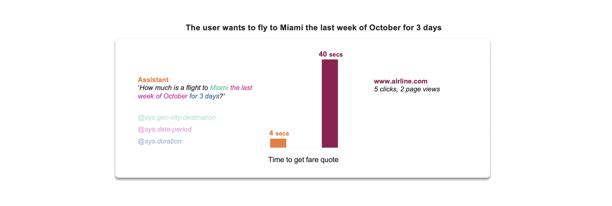
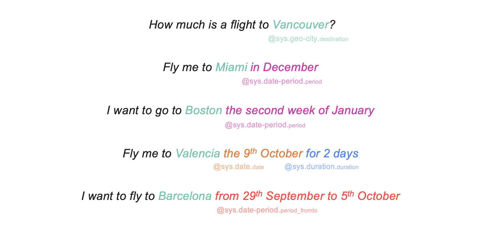
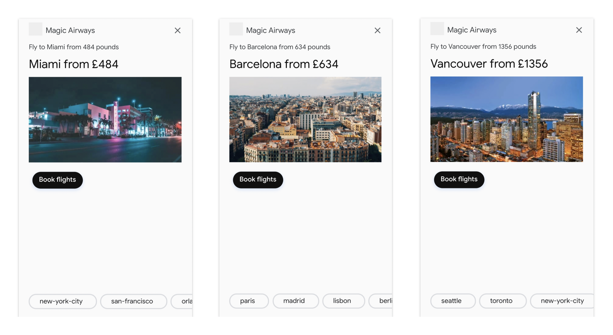
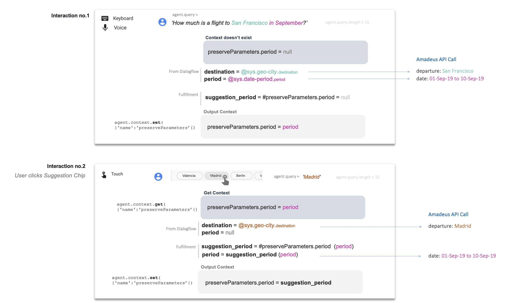
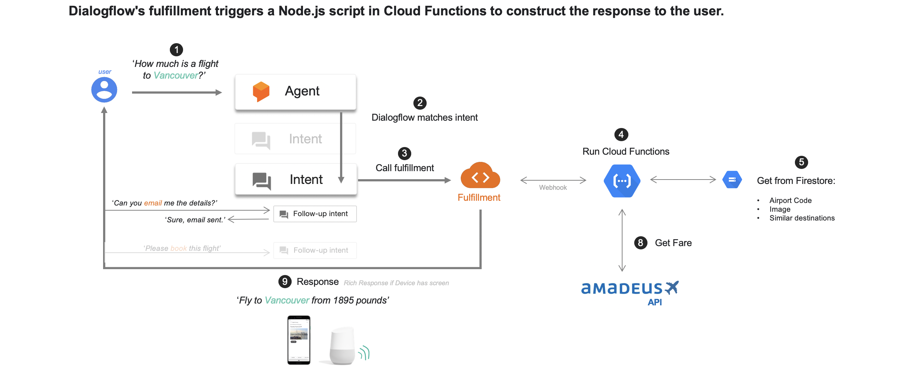
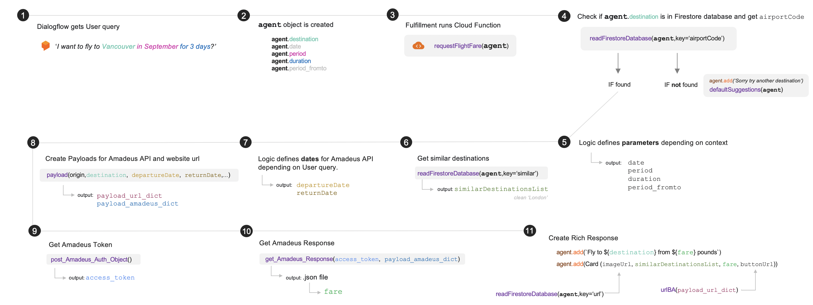
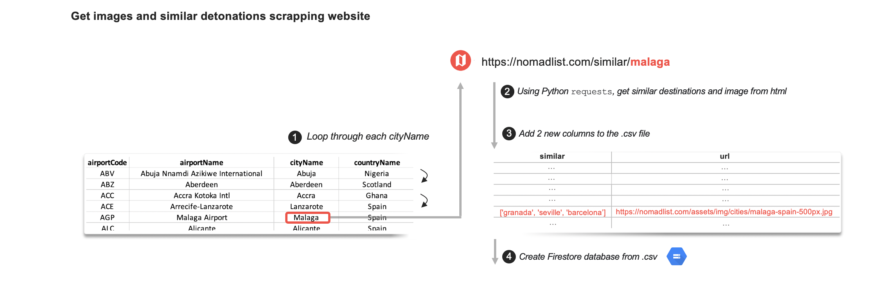
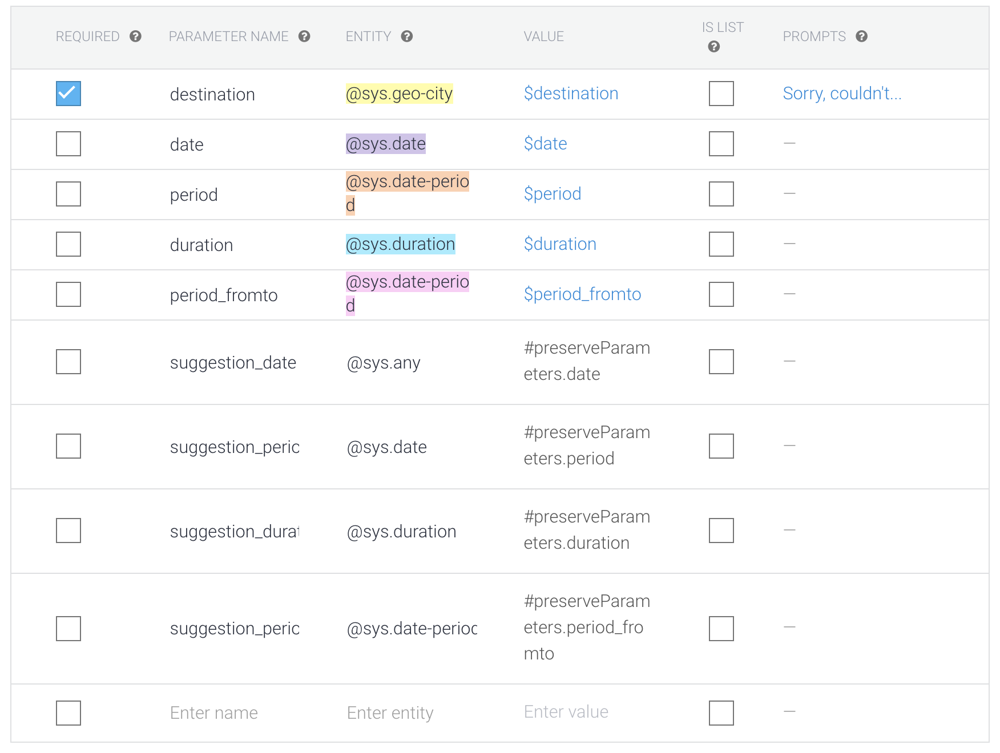
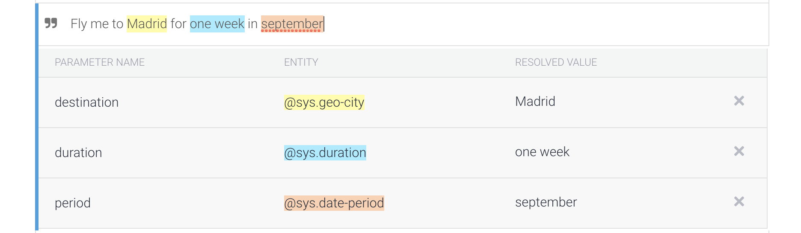
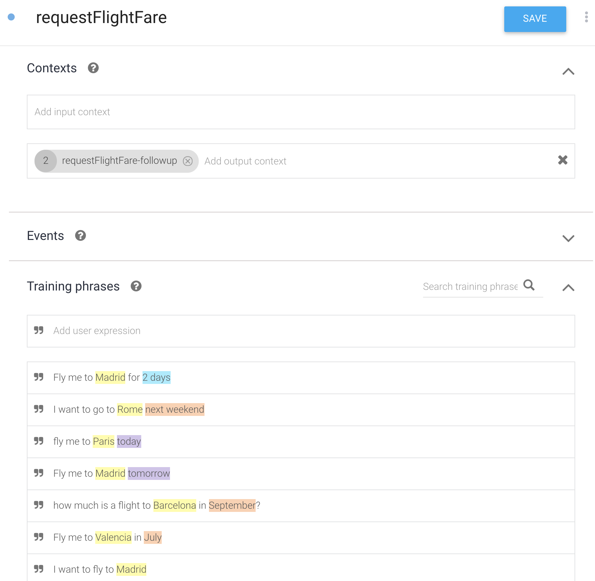

# Flight Fare Finder - Google Assistant


## Content
- [Overview](#overview)
- [Destination images and similar destinations Suggestion Chips](#appendix-destination-images-and-similar-destinations-suggestion-chips)
- [Dialogflow setup](#dialogflow-setup)
- [High Level diagram](#high-level-diagram)
- [Code description](#index.js-description)


## Overview

The aim of this project is to get User's **queries about how much is a flight to a destination** using Google Assistant, to **get the lowest fare** from [Amadeus](https://amadeus.com/en/industries/airlines), and **reply back** to the User. 

The User can interact with the assistant via **voice**,**keyboard** or **touching** the device screen.

This way of getting travel inspiration has many benefits in terms of **accessibility** compared to traditional booking tools offered by the airlines websites. In addition, this new channel is much faster.



Thanks to Dialogflow, this application could work as well in other languages. We would just need to provide more training sentences, and then translate some parameters using Google Translation API (i.e A Spanish user says: *Quiero volar a París en Diciembre durante dos días*, the agent would pick `destination=París` and `duration=días`, we would need to translate to `Paris` and `days` (or change the code).

For the sake of simplicity, at the moment it only works for routes operated by British Airways from Heathrow Airport and for one passenger. Changing this is as easy as modify some values in the API call.

Some examples:





## Dialogflow setup
(Pending)

First, make sure you understand the basics of Dialogflow: you can start [here](https://cloud.google.com/dialogflow/docs/).

Make sure you enable Webhook calls for the Intent. In this example we create two follow-up intentes directly from Dialogflow console (not fulfullment) that simulate the User asking *'Hey, email me this info'* or *'Please book me in this flight'*.

Find some screenshots in the [appendix](#appendix:-dialogflow-screenshots)

We use context to carry information from consecutive interactions:




## High Level diagram
(Pending)




I create the script localy and then [deploy](https://cloud.google.com/functions/docs/deploying/filesystem) it using the terminal command `gcloud functions deploy <folder>`


There are files:
- [index.js ](index.js)
- [package.json](package.json)

Make sure you enable webhook calls for your Intent.

## `index.js` description

You can find the full code in [index.js](index.js).



The beginning of the file has all the imports needed. We take this code mainly from Google's documentation.

```javascript
// The Cloud Functions for Firebase SDK to create Cloud Functions and setup triggers.
const functions = require('firebase-functions');
// The Firebase Admin SDK to access the Firebase Realtime Database.
const admin = require('firebase-admin');
// Import the dialogflow class
const {WebhookClient} = require('dialogflow-fulfillment');

const { Card, Suggestion } = require('dialogflow-fulfillment');
//const { Carousel } = require('actions-on-google');

process.env.DEBUG = 'dialogflow:*'; // enables lib debugging statements

// initialize Firebase
admin.initializeApp(functions.config().firebase);
admin.firestore().settings({timestampsInSnapshots: true})
```

We define some helper functions before the main one:

- welcome(agent)
- fallback(agent)
- post_Amadeus_Auth_Object()
- get_Amadeus_Response(access_token, payload_dict)
- payload(origin,destination,departureDate,returnDate,...)
- urlBA(payload_url_dict)
- readFirestoreDatabase(agent,key)
- durationHandler(duration)
- defaultSuggestions(agent)
- [MAIN](#cloud-function)

#### Welcome and Fallback functions.

Welcome Intent: triggered when the user starts the conversation.
Fallback Intent: triggered when the Agent can't match the query with any Intent.In both cases, we want the user to get some [Suggestion Chips](https://developers.google.com/actions/assistant/responses) to give some inspiration.

```javascript
function welcome(agent) {
    agent.add(`Hi, where do you want to fly to?`);
    defaultSuggestions(agent) // Inspire the User - show some suggested destinations
}
function fallback(agent) {
    agent.add(`I'm sorry, can you try again?`);
    defaultSuggestions(agent) // Inspire the User - show some suggested destinations
}
```

The Amadeus API has a standard POST/GET interaction, you can read more about it [here](https://developers.amadeus.com/self-service/category/air/api-doc/flight-low-fare-search/api-reference). You will need to create a test account to get your `client_id` and `client_secret`.

First, using a `POST` request we get the `access_token`. Then, with a `GET` request we ask for the json file containing flights and fares. 

Here you can see an example of [Amadeus API response](#amadeus-response-example)
 
#### Amadeus Authentication
```javascript
// Amadeus Authentication
function post_Amadeus_Auth_Object() {
    // https://developers.amadeus.com/self-service/category/air/api-doc/flight-low-fare-search
    var request = require("request");
    return new Promise(resolve => {
        var options = { method: 'POST',
            url: 'https://test.api.amadeus.com/v1/security/oauth2/token',
            headers:
                { 'Content-Type': 'application/x-www-form-urlencoded' },
            form:
                { grant_type: 'client_credentials',
                    client_id: 'XXXXXXXXXXXXXXXXX',
                    client_secret: 'XXXXXXXXXXXXXXXXX' } };

        request(options, function (error, response, body) {
            if(!error)
                resolve(JSON.parse(body));
        })
    }).then(value => {
        return value;
    }).catch(err => {
        console.log(`Error: ${err}`);
    });
}
```

#### Amadeus API GET

```javascript
// Amadeus GET API call
function get_Amadeus_Response(access_token, payload_dict) {
    // Returns a json file from Amadeus API https://developers.amadeus.com/self-service/category/air/api-doc/flight-low-fare-search:
    // Inputs:
    //     access_token: string -> from post_Amadeus_Auth_Object()
    //     payload_dict: dict   -> from payload()


    var request = require("request");
    return new Promise(resolve => {
        var options = { method: 'GET',
            url: 'https://test.api.amadeus.com/v1/shopping/flight-offers',
            qs: payload_dict,
            headers:
                { Authorization: 'Bearer ' + access_token } };

        request(options, function (error, response, body) {
            if(!error)
                resolve(JSON.parse(body));
        })
    }).then(value => {
        return value;
    }).catch(err => {                                    
        return console.log(`Error connecting to Amadeus: ${err}`);        
    })
}
```

#### Create Payloads

```javascript
// Create payload dictionaries for Amadeus API request and ba.com url.
function payload(origin,destination,departureDate,returnDate,adults='1',includeAirlines='BA',nonStop='true',max='1') {
    // Returns two dictionaries:
    // 1. Amadeus GET payload and 2. Variables to create ba.com URL.
    // Inputs:
    //     origin:         string     any IATA airport code -> MAD, YVR, TXL... *This version only allows 'LHR' as origin.
    //     destination:    string     any IATA airport code -> MAD, YVR, TXL...
    //     departureDate:  string    'YYYY-MM-DD'
    //     returnDate:     string    'YYYY-MM-DD'
    //     adults:         string    greater than 0, '1', '2'...
    //     includeAirlines string    IATA airline code -> 'BA', 'IB', 'AA'... *This version only allows 'BA' British Airways
    //     nonStop         string    'true' to get only Direct itineraries; 'false' otherwise *For simplicity, this version only takes Direct itineraries
    //     max             string    ['1' - '250'] Maximum number of flight offers to return.
    //
    //    Full Reference: https://developers.amadeus.com/self-service/category/air/api-doc/flight-low-fare-search/api-reference

    // one-way or return. In this version, we always set a return date.
    let journeyType = (returnDate) ? 'RTFLT' : 'OWFLT';

    let payload_amadeus_dict = { origin: origin,
        destination: destination,
        departureDate: departureDate,
        adults: adults,
        includeAirlines: includeAirlines,
        nonStop: nonStop,
        max: max };

    // For the url, we use outbound/inbound variable names because these is the format for ba.com URL.
    let payload_url_dict = { origin: origin,
        destination: destination,
        outboundDate: departureDate,
        adultCount: adults,
        youngAdultCount: "0",
        childCount: "0",
        infantCount: "0",
        cabin:'M',
        ticketFlexibility:'LOWEST',
        journeyType: journeyType,
        source: 'false' };
    // add dictionary keys if values are provided
    if (returnDate) payload_amadeus_dict["returnDate"] = returnDate;
    if (returnDate) payload_url_dict["inboundDate"] = returnDate;

    return [payload_amadeus_dict, payload_url_dict];
}
```

#### britiwshairways.com url

In the Card Response, we will add a 'Book' botton that will take the User to the Flight List page in the airline page. In this example we use British Airways website. 

```javascript
// Create ba.com url to direct user to result list
function urlBA(payload_url_dict) {
    // Returns ba.com url from a dictionary created using payload() function:
    //         origin: origin,
    //         destination: destination,
    //         outboundDate: departureDate,
    //         adultCount: adults,
    //         etc...

    let url = "https://www.britishairways.com/travel/booking/public/en_gb/#/flightList?"


    for (const [key, value] of Object.entries(payload_url_dict)) {
        url = url.concat([key, value].join('='),'&');
    };
    return url;
}
```


#### Read Firestore database
(Pending: add explanation)

```javascript
function readFirestoreDatabase(agent,key) {
    // Returns value for input key
    //
    // Input:
    //    agent : dialogflow object
    //    key   : string -> 'airportCode', 'airportName', 'countryName', 'similar', 'url'

    // Initialise Firestore
    const db = admin.firestore();
    // Firebase is organised in Collections and Documents, https://firebase.google.com/docs/firestore
    // collection: 'destinations'
    // |_______ documents:
    //     |_____________ 'amsterdam'  :  { airportCode: 'AMS',
    //                                      airportName: 'Amsterdam',
    //                                      cityName:    'Amsterdam',
    //                                      countryName: 'Netherlands',
    //                                      similar: ['berlin', 'paris', brussels',...]
    //                                      url: 'http://...'}
    //     |_____________ 'abu dhabi' : ...
    //     |_____________ 'berlin'    : ...
    //     |_____________ 'cancun'    : ...

    // destination will be the document name that we will open
    let destination = agent.parameters.destination; //


    const documentLocation = db.collection('destinations').doc(destination.toLowerCase());

    return documentLocation.get()
        .then(doc => {
            if (!doc.exists) { // if destination does not exist in database
                console.log(`document ${destination.toLowerCase()} not in database. Please try another destination.`); // Using Dialogflow, we set destination as required, so we make sure that the users specifies a destination. However, that destination may not exist in the database.
            } else { // if destination exists in the database
                if (key === "airportCode") {
                    return doc.data().airportCode;
                } else if (key === "similar") {
                    return doc.data().similar;
                } else if (key === "url") {
                    return doc.data().url;
                } else {
                    console.log(`key ${key} not implemented yet`)
                };
            }
        }).catch(() => {
            console.log(`error reading database`);
        });
}
```


#### Convert  duration into Number Of Days.

```javascript
function durationHandler(duration) { // Converts duration (days, weeks...) into number of days. duration is and Object from Dialogflow.
    if (duration.unit === "day") {
        durationDays = duration.amount;
    } else if (duration.unit === "wk") { // weeks
        durationDays = duration.amount * 7 ;
    } else if (duration.unit === "mo") { // months
        durationDays = duration.amount / 30 ;
    } else if (duration.unit === "h") { // hours
        durationDays = duration.amount / 24;
    } else if (duration.unit === "min") { // minutes
        durationDays = duration.amount / 1440 ;
    } else if (duration.unit === "s") { // seconds
        durationDays = duration.amount / 86400 ;
    }
    return durationDays
}
```

#### Default Suggestion Chips

```javascript
function defaultSuggestions(agent) {
    agent.add(new Suggestion('Valencia')); // Inspire the User - show some suggested destinations
    agent.add(new Suggestion('Madrid'));
    agent.add(new Suggestion('Berlin'));
    agent.add(new Suggestion('Vancouver'));
}
```

#### Cloud Function

```javascript
// **** Cloud Function ****

exports.flights = functions.https.onRequest((request,response) =>{

    const agent = new WebhookClient({request, response });
  
    async function requestFlightFare(agent) { // use async so we can use Promise within the function. Need to learn more about this...


        // declare variables
        let destination   = null
        let date          = null
        let period        = null
        let duration      = null
        let period_fromto = null

        // Airport Code of destination
        let airportCode = await readFirestoreDatabase(agent,"airportCode"); // Searches destination in Firestore database, and gets Airport Code
        if (airportCode == null){// if destination is not in the database
            agent.add(`${agent.parameters.destination} is not in my database. Sorry. Try another destination.`)
            defaultSuggestions(agent)

        } else {
            console.log(`OK - ${airportCode} Airport in database`)

            // temporary workaround till I know how to modify parameters or change Suggestion Chip label
            if (agent.query.length <15) { // Short Speech: occurs when user has clicked on a Suggestion Chip in the previous interaction. i.e. 'Madrid'
                agent.context.get('preserveParameters')

                destination   = agent.parameters.destination
                date          = agent.parameters.suggestion_date            // string: YYYY-MM-DDTHH:MM:SS+00:00
                period        = agent.parameters.suggestion_period          // object: { "endDate": "YYYY-MM-DDTHH:MM:SS+00:00", "startDate": "YYYY-MM-DDTHH:MM:SS+00:00" } i.e. Fly me in September
                duration      = agent.parameters.suggestion_duration        // object: { "amount": <number>, "unit": <string> }
                period_fromto = agent.parameters.suggestion_period_fromto   // object: { "endDate": "YYYY-MM-DDTHH:MM:SS+00:00", "startDate": "YYYY-MM-DDTHH:MM:SS+00:00" } i.e. Fly me from the 3rd September to 9th September

                agent.context.set({
                    'name':'preserveParameters',
                    'lifespan': 10,
                    'parameters':{
                        'date':         date  ,
                        'period':       period,
                        'duration':     duration ,
                        'period_fromto':period_fromto
                    }
                });


            } else { // Long Speech: occurs when user asks something like: 'Fly me to Miami', 'I want to go to Miami', 'How much is a flight to Miami'
                agent.context.set({
                    'name':'preserveParameters',
                    'lifespan': 1,
                    'parameters':{
                        'date':         agent.parameters.date  ,
                        'period':       agent.parameters.period,
                        'duration':     agent.parameters.duration ,
                        'period_fromto':agent.parameters.period_fromto
                    }
                });

                // Parameters from Dialogflow agent
                destination   = agent.parameters.destination     // it is set up in Dialogflow as 'required' - it doesn't mean that the destination is in the Airport code database or that Amadeus will recognise it
                date          = agent.parameters.date            // string: YYYY-MM-DDTHH:MM:SS+00:00
                period        = agent.parameters.period          // object: { "endDate": "YYYY-MM-DDTHH:MM:SS+00:00", "startDate": "YYYY-MM-DDTHH:MM:SS+00:00" } i.e. Fly me in September
                duration      = agent.parameters.duration        // object: { "amount": <number>, "unit": <string> }
                period_fromto = agent.parameters.period_fromto   // object: { "endDate": "YYYY-MM-DDTHH:MM:SS+00:00", "startDate": "YYYY-MM-DDTHH:MM:SS+00:00" } i.e. Fly me from the 3rd September to 9th September

            }


            // Similar destinations
            let similarDestinationsList = await readFirestoreDatabase(agent,"similar")
            indexLondon = similarDestinationsList.indexOf("london")
            if (indexLondon > -1) { // check if 'london' in similarDestinationsList
                similarDestinationsList.splice(indexLondon, 1); // it mutates the array!
            }


            // Parameter for Amadeus call Payload
            let origin        = 'LHR'; // In this version we only allow Heathrow Airport as Origin
            let departureDate = false; // declare variable ---> string YYY-MM-DD
            let returnDate    = false; // declare variable ---> string YYY-MM-DD

            // Dates
            let today = new Date();    // today: type object
            let dateFrom = new Date(); // auxiliar variable. We will add days to this Date depending on trip duration, etc.. : type object
            let dateTo = new Date();   // value assigned later

            // days_future = number of days added to 'today' if the User does not specify departure and/or return dates.
            // i.e User: 'Fly me to Madrid' ---> today = 2019-08-25, days_future = 3 , then: departureDate = today + days_future = 2019-08-28
            let days_future = 3;

            // length_stay = number of days added to departureDate if the User does not specify return date. *This version only accepts return itineraries.
            // i.e User: 'Fly me to Madrid the 1st September' ---> departureDate = 2019-09-01, length_stay = 7,  then: returnDate = departureDate + length_stay = 2019-09-07
            let length_stay = 10;

            // If Users specifies duration, i.e. 'Fly me to Miami for one week', length_stay is updated from default to = 7 (days)
            // duration is and Object from Dialogflow.
            if (duration) length_stay = durationHandler(duration)


            /*  2. Processing User input: the are several ways the User can ask for a flight fare:

            1. Fly me to Madrid                                         -> destination
            2. Fly me to Madrid the 5th of august                       -> destination + date
            3. Fly me to Madrid from the 6th July to the 16th August    -> destination + period_fromto
            4. Fly me to Madrid in September                            -> destination + period
            5. Fly me to Madrid (date or period) for 4 days             -> destination + OR(date,period) + duration , in this case, we change length_stay variable

            Thanks to Dialogflow, the assistant will convert more complex sentences into dates or periods:
            - Fly me to Madrid tomorrow.  (it will create agent.parameters.date depending on today)
            - Fly me to Madrid next weekend. (t will create agent.parameters.period depending on today)
            - Fly me to Madrid the last weekend of November.

            Not yet:
            - How much is a flight to Madrid with departure on 4th august and return the 9th september

            */


            // 1. User: 'Fly me to Madrid'
            if (destination  && !date && !period && !period_fromto) {

                //agent.add(`Fly to ${destination}`);


                dateFrom.setDate(today.getDate() + days_future);  // set dateFrom =  today + days_future
                console.log('Date from ', dateFrom)

                dateTo.setDate(dateTo.getDate() + days_future + length_stay);
                console.log('Date to ', dateTo)

                departureDate = dateFrom.toISOString().substr(0, 10);
                returnDate    = dateTo.toISOString().substr(0, 10);
                console.log('Departure ', departureDate)
                console.log('Return ', returnDate)


            }

            // 2. 'Fly me to Madrid the 5th of august'
            else if (destination  && date && !period && !period_fromto) {


                dateFrom = new Date(date);
                departureDate = date.substr(0, 10); // Get 10 first characters, from 'YYYY-MM-DDT00:00:00.000Z' to 'YYYY-MM-DD'

                dateTo = new Date(dateFrom)
                dateTo.setDate(dateFrom.getDate() + length_stay);
                returnDate    = dateTo.toISOString().substr(0, 10);


                // 3. Fly me to Madrid from the 6th July to the 16th
            } else if (destination  && !date && !period && period_fromto) {
                departureDate = period_fromto.startDate.split("T")[0]
                returnDate   = period_fromto.endDate.split("T")[0]


                // 4. Fly me to Madrid in September
            } else if (destination  && !date && period && !period_fromto) {

                // period:          Dialogflow object: { startDate: "YYYY-MM-DDTHH:MM:SSZ", endDate: "2019-09-30T23:59:59Z" } (Z = Zulu time, +00:00)
                // startDatePeriod: Date object
                // endDatePeriod:   Date object
                let startDatePeriod = new Date(period.startDate.substr(0, 10)) // If you input the whole string into Date(), it returns the day before. Just giving the YYYY-MM-DD works.  This is a workaround
                let endDatePeriod = new Date(period.endDate.substr(0, 10))

                if (startDatePeriod > today) { // If today is 3rd September, and user says 'Fly me to Miami in October'

                    //dateFrom = startDatePeriod

                    // departureDate ---> string
                    departureDate = startDatePeriod.toISOString().substr(0, 10);

                    // We do the following in two steps because we couldn't find a better way at the moment
                    dateTo = new Date(startDatePeriod) // update dateTo
                    dateTo.setDate(length_stay) // add length_stay

                    // returnDate ---> string
                    returnDate = dateTo.toISOString().substr(0, 10);


                } else { // If today is 3rd September, and user says 'Fly me to Miami in September'

                    // set dateFrom (departure) at the middle of the period [today, end of period]
                    // i.e today is 2019-08-20, User says: 'Fly me to X in August', dateFrom = 2019-08-20 + (10 days till end of period divided by 2) = 2019-08-25

                    dateFrom.setDate(today.getDate() + (Math.abs( endDatePeriod.getDate() - today.getDate())/2))

                    // departureDate ---> string
                    departureDate = dateFrom.toISOString().substr(0, 10);


                    dateTo.setDate(dateFrom.getDate() + length_stay)

                    // returnDate ---> string
                    returnDate  = dateTo.toISOString().substr(0, 10);


                }

            } else {
                agent.add("Not yet")
            }


            /*
            AMADEUS API CALL
             */

            if (airportCode) { // If Airport Code found in the database


                // create dictionaries for Amadeus API GET payload and ba.com url
                let [payload_amadeus_dict, payload_url_dict] = payload(origin,airportCode,departureDate,returnDate,adults='1',includeAirlines='BA',nonStop='true',max='1')
                // create ba.com url
                let url = urlBA(payload_url_dict)

                // Amadeus Authentication
                let authObject = await post_Amadeus_Auth_Object();
                // get header 'access_token' from the Authentication object
                let access_token = authObject["access_token"];

                // Amadeus API GET Request/Response
                let amadeusResponse = await get_Amadeus_Response(access_token, payload_amadeus_dict);

                try {
                    let fare = parseInt(amadeusResponse['data'][0]['offerItems'][0]['pricePerAdult']['total'])  //parseInt removes the decimals
                    agent.add(`Fly to ${destination} from ${fare} pounds`)
                    const { Card, Suggestion } = require('dialogflow-fulfillment');
                    //const { Carousel } = require('actions-on-google');

                    agent.add(new Card({
                            title: `${destination} from £${fare}`,
                            imageUrl: await readFirestoreDatabase(agent,"url"),
                            //text: 'some text', // In next versions, add personalised text to each destination, i.e. Valencia `Eat paella 🥘 and enjoy the sun ☀️`
                            buttonText: 'Book flights',
                            buttonUrl: url
                        })
                    );

                    if (similarDestinationsList.length < 4) {

                    } else {
                        agent.add(new Suggestion(similarDestinationsList[0]));
                        agent.add(new Suggestion(similarDestinationsList[1]));
                        agent.add(new Suggestion(similarDestinationsList[2]));
                        agent.add(new Suggestion(similarDestinationsList[3]));
                    }
                }
                catch(err) {
                    console.log(`Sorry, I couldn't find any flight to ${destination} from ${departureDate} to ${returnDate}. Ask for different dates or try another destination.`)
                    agent.add(`Sorry, I couldn't find any flight to ${destination} from ${departureDate} to ${returnDate}. Ask for different dates or try another destination.`)
                    defaultSuggestions(agent)
                }


            } else {
                agent.add('Airport not in database. Please try another destination.')


            }


        }


    }
  


    
    let intentMap = new Map();
  	intentMap.set("requestFlightFare",requestFlightFare);
    intentMap.set('Default Welcome Intent', welcome);
    intentMap.set('Default Fallback Intent', fallback);
    
    
    agent.handleRequest(intentMap);
});
```


## Appendix: Destination images and similar destinations Suggestion Chips

The main database we will use is stored in Firestore. We will load a [reference table](/aIrport_codes_200.csv) for 200 destinations, containing.

Each destination in the database has an image and a list of similar destinations. The image is an url where theimage is hosted. 

You could build this database with your own images and calculate the similarity based on users behaviour on your website, geographic proximity, themes (beach, ski, nature...) , etc. In this example we will use an already built database from [Nomadlist.com](https://nomadlist.com), a nice website with lots of info about places to visit. 



```python

all_similar_array = []
all_images_array  = []

for city in list(df['cityName']): # loop for every city in column 'cityName'
    url = "https://nomadlist.com/similar/" + city.lower().replace(" ","-") # create url, i.e. 'New York' ->  "https://nomadlist.com/similar/new-york"
    
    if similarDestinations(url) != []: # url is valid for that city name
        all_similar_array.append(similarDestinations(url)) # append array of similar destinations
        all_images_array.append(imageDestinations(url))    # append image url
        
    else:
        all_similar_array.append(similarDestinations(url)) # [] empty array will be appended
        all_images_array.append("http://logok.org/wp-content/uploads/2014/04/British-Airways-logo-ribbon-logo.png")   # default image    
        
df['similar'] = all_similar_array  # add column   
df['url'] = all_images_array       # add column   

df.to_csv('<path>/airport_codes_200.csv') # save csv
    
#### Function definitions

def similarDestinations(url):
    # input:    string 'https://nomadlist.com/similar/<destination>'
    # returns:  array of strings ['madrid', 'lisbon', 'paris']
    response = requests.get(url)
    soup = BeautifulSoup(response.text, "html.parser")
    s = ''.join(str(tag) for tag in soup.findAll("h3", {"class": "itemName"}))
    similar_destinations_array = re.findall(r'href="/(.*?)"', s)
    return similar_destinations_array

def imageDestinations(url):
    # input:    string 'https://nomadlist.com/similar/<destination>'
    # returns:  string 'https://nomadlist.com/assets/img/cities/abu-dhabi-united-arab-emirates-500px.jpg'
    response = requests.get(url)
    soup = BeautifulSoup(response.text, "html.parser")
    image_url = "https://nomadlist.com" + soup.findAll("img", {"class": "bg-modal"})[0]['src']
    return image_url

```

## Appendix: Dialogflow screenshots




