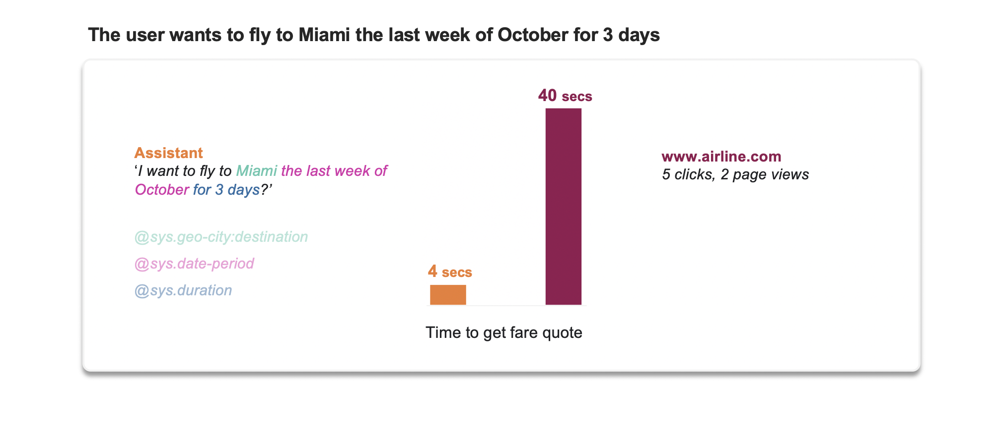
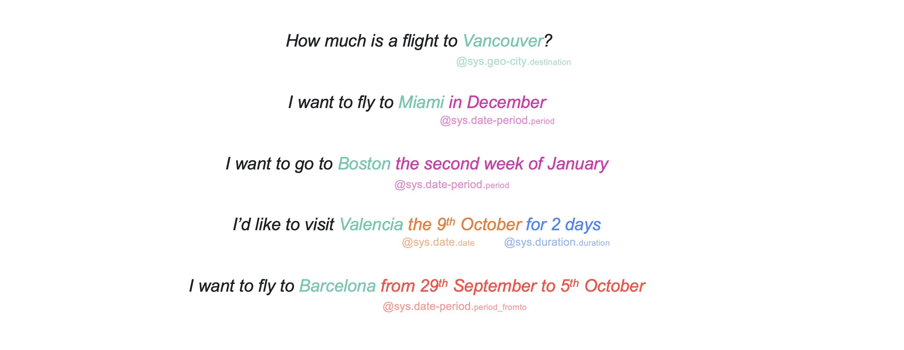
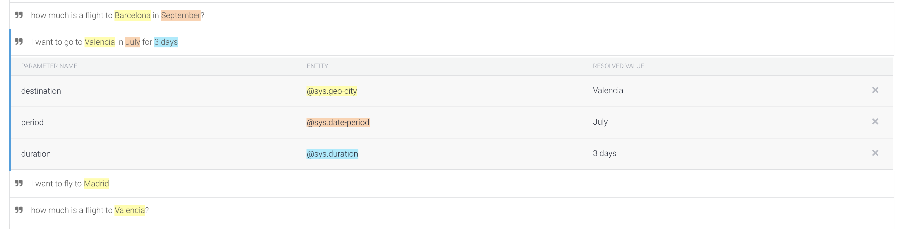

# Cleaning code - Flight Fare Finder - Google Assistant

Hi! Thanks for coming :) I'm cleaning the code after some great feedback from a Senior Developer. You'll publish the code soon.


## Content
- [Overview](#overview)
- [Dialogflow setup](#dialogflow-setup)
- [Architecture](#architecture)
- [Code description](#code-description)
- [Appendix: Destination images and similar destinations Suggestion Chips](#appendix-destination-images-and-similar-destinations-suggestion-chips)

[test](https://github.com/pabloferg/dialogflow-flights/blob/master/index.js#L62)

## Overview

The aim of this project is to get User's **queries about how much is a flight to a destination** using Google Assistant, to **get the lowest fare** from [Amadeus](https://amadeus.com/en/industries/airlines), and **reply back** to the User. 

The User can interact with the assistant via **voice**, **keyboard** or **touching** the device screen.

This way of getting travel inspiration has many benefits in terms of **accessibility** compared to traditional booking tools offered by the airlines websites. In addition, this new channel is much faster.



Thanks to Dialogflow, this application could work as well in **other languages**. We would just need to provide more training sentences, and then translate some parameters using Google Translation API (i.e A Spanish user says: *Quiero volar a París en Diciembre durante dos días*, the agent would pick `destination=París` and `duration=días`, we would need to translate to `Paris` and `days` (or change the code). But we don't have to worry about `Diciembre` because Dialogflow will get the `period` correctly with same format `YYYY-MM-DDTHH:MM:SS+00:00` as in English.

For the sake of simplicity, at the moment this code only works for direct routes operated by British Airways from Heathrow Airport and for one passenger. Changing this is as easy as modifying some values in the API call.

Next Steps:
- Improve code, especially the way I handle dates. 
- Add more inspiration capabilities: i.e. *'I want to fly to a sunny place in December'*
- Allow more inputs from the User: *'Flights to Madrid for 2 adults and 1 infant in Business'*
- Use context not only carrying dates and inputing a new destination, but viceversa: i.e User: *'I want to fly to Ibiza next weekend'*, (agent response), *'And for the last weekend of November?'*
- Add some Analytics capabilities that would allow the Airline to monitor the number of users, which are the popular destinations, which travel periods, etc. We'd need some kind of [counter](https://firebase.google.com/docs/firestore/solutions/counters)?
- Add schedule information? 'It departs at 17:30', or 'There's daily flights to Miami', or 'You can only fly to Seville wednesdays and fridays during winter' (? not priority)
- Create some automated testing, I've never done this.

Some examples:




## Dialogflow setup
(Pending)

First, make sure you understand the basics of Dialogflow: you can start [here](https://cloud.google.com/dialogflow/docs/).

Make sure you enable Webhook calls for the Intent.

In this example we create two follow-up intentes directly from Dialogflow console (not fulfullment) that simulate the User asking *'Hey, email me this info'* or *'Please book me in this flight'*.

Find some screenshots in the [appendix](#appendix:-dialogflow-screenshots)

We use context to carry information between consecutive interactions:


## Architecture
(Pending)


I develop the script localy on my machine and then [deploy](https://cloud.google.com/functions/docs/deploying/filesystem) it using the terminal command `gcloud functions deploy <folder>`

There are two files:
- [index.js ](index.js)
- [package.json](package.json)


## Code description

You can find the full code in [index.js](index.js).


The beginning of the file has all the imports needed. We take this code mainly from Google's documentation.

(Pending)

We define some helper functions before the main one:

- welcome(agent)
- fallback(agent)
- post_Amadeus_Auth_Object()
- get_Amadeus_Response(access_token, payload_dict)
- payload(origin,destination,departureDate,returnDate,...)
- urlBA(payload_url_dict)
- readFirestoreDatabase(agent,key)
- durationHandler(duration)
- defaultSuggestions(agent)
- [MAIN](#cloud-function)

#### Welcome and Fallback functions.

Welcome Intent: triggered when the user starts the conversation.

Fallback Intent: triggered when the Agent can't match the query with any Intent

In both cases, we want the user to get some [Suggestion Chips](https://developers.google.com/actions/assistant/responses) to give some inspiration.

(Pending)

The Amadeus API has a standard POST/GET interaction, you can read more about it [here](https://developers.amadeus.com/self-service/category/air/api-doc/flight-low-fare-search/api-reference). You will need to create a test account to get your `client_id` and `client_secret`.

First, using a `POST` request we get the `access_token`. Then, with a `GET` request we ask for the json file containing flights and fares. 

Here you can see an example of [Amadeus API response](AmadeusResponseExample.json)
 


## Appendix: Destination images and similar destinations Suggestion Chips

The main database we will use is stored in Firestore. We will load a [reference table](/aIrport_codes_200.csv) for 200 destinations.

Each destination in the database has an **image url** and a list of **similar destinations**.

You could build this database with your own images and calculate the similarity based on users behaviour on your website, geographic proximity, themes (beach, ski, nature...) , etc. In this example we will use an already built database from [Nomadlist.com](https://nomadlist.com), a nice website with lots of info about places to visit. 

(Pending: add more explanation)


The following is python code.

```python

all_similar_array = []
all_images_array  = []

for city in list(df['cityName']): # loop for every city in column 'cityName'
    url = "https://nomadlist.com/similar/" + city.lower().replace(" ","-") # create url, i.e. 'New York' ->  "https://nomadlist.com/similar/new-york"
    
    if similarDestinations(url) != []: # url is valid for that city name
        all_similar_array.append(similarDestinations(url)) # append array of similar destinations
        all_images_array.append(imageDestinations(url))    # append image url
        
    else:
        all_similar_array.append(similarDestinations(url)) # [] empty array will be appended
        all_images_array.append("http://logok.org/wp-content/uploads/2014/04/British-Airways-logo-ribbon-logo.png")   # default image    
        
df['similar'] = all_similar_array  # add column   
df['url'] = all_images_array       # add column   

df.to_csv('<path>/airport_codes_200.csv') # save csv
    
#### Function definitions

def similarDestinations(url):
    # input:    string 'https://nomadlist.com/similar/<destination>'
    # returns:  array of strings ['madrid', 'lisbon', 'paris']
    response = requests.get(url)
    soup = BeautifulSoup(response.text, "html.parser")
    s = ''.join(str(tag) for tag in soup.findAll("h3", {"class": "itemName"}))
    similar_destinations_array = re.findall(r'href="/(.*?)"', s)
    return similar_destinations_array

def imageDestinations(url):
    # input:    string 'https://nomadlist.com/similar/<destination>'
    # returns:  string 'https://nomadlist.com/assets/img/cities/abu-dhabi-united-arab-emirates-500px.jpg'
    response = requests.get(url)
    soup = BeautifulSoup(response.text, "html.parser")
    image_url = "https://nomadlist.com" + soup.findAll("img", {"class": "bg-modal"})[0]['src']
    return image_url

```

Create FIrestore database from .csv file:

```python
from firebase_admin import credentials
from firebase_admin import firestore

# Use a service account
cred = credentials.Certificate('<path to certificate>')
firebase_admin.initialize_app(cred)
db = firestore.client()

df = pd.read_csv('/<path>/airport_codes_200.csv')

# loop through each row in the pandas dataframe and create new document in Firestore
for index, row in df.iterrows():
    
    doc_ref = db.collection('destinations').document(row['cityName'].lower()) # document name = cityName
    # add document content
    doc_ref.set({
        'airportCode'        :  row['airportCode'],
        'airportName'        :  row['airportName'],
        'countryName'        :  row['countryName'],
        'cityName'           :  row['cityName'],
        'similar'            :  row['similar'].replace("[","").replace("]","").replace("'","").split(', '), # process string so that Firestore stores it as a list
        'url'                :  row['url']    })

```


## Appendix: Dialogflow screenshots



