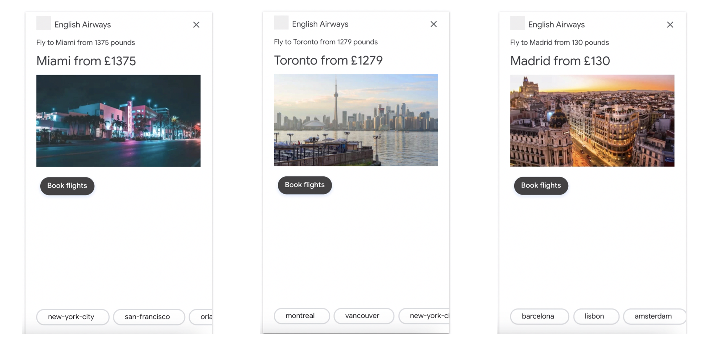
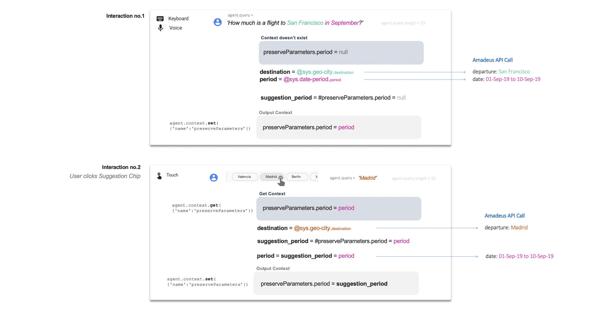

# Voice Flight Searcher: Dialogflow + Google Cloud + Amadeus API

## Content

- [Destination images and similar destinations Suggestion Chips](#Destination-images-and-similar-destinations-suggestion-chips)


The objective of this project is to get User's **queries about flight fares to destinations** using Dialogflow, to **get the lowest fare** from [Amadeus](https://amadeus.com/en/industries/airlines), and **reply back** to the user. 

For the sake of simplicity, at the moment it only works for routes operated by British Airways from Heathrow Airport and one adult. Changing this is as easy as modify some values in the API call.

First, make sure you understand the basics of Dialogflow: you can start [here](https://dialogflow.com/docs/getting-started).

For this example we just create one Agent and one Intent (`requestFlightFare`).

Make sure you enable Webhook calls for the Intent.





## Destination images and similar destinations Suggestion Chips

The main database we will use is stored in Firestore. We will load a [reference table](/aIrport_codes_200.csv) for 200 destinations, containing.

Each destination in the database has an image and a list of similar destinations. The image is an url where theimage is hosted. 

You could build this database with your own images and calculate the similarity based on users behaviour on your website, geographic proximity, themes (beach, ski, nature...) , etc. In this example we will use an already built database from [Nomadlist.com](https://nomadlist.com), a nice website with lots of info about places to visit. 


```python

all_similar_array = []
all_images_array  = []

for city in list(df['cityName']): # loop for every city in column 'cityName'
    url = "https://nomadlist.com/similar/" + city.lower().replace(" ","-") # create url, i.e. 'New York' ->  "https://nomadlist.com/similar/new-york"
    
    if similarDestinations(url) != []: # url is valid for that city name
        all_similar_array.append(similarDestinations(url)) # append array of similar destinations
        all_images_array.append(imageDestinations(url))    # append image url
        
    else:
        all_similar_array.append(similarDestinations(url)) # [] empty array will be appended
        all_images_array.append("http://logok.org/wp-content/uploads/2014/04/British-Airways-logo-ribbon-logo.png")   # default image    
        
df['similar'] = all_similar_array  # add column   
df['url'] = all_images_array       # add column   

df.to_csv('<path>/airport_codes_200.csv') # save csv
    
#### Function definitions

def similarDestinations(url):
    # input:    string 'https://nomadlist.com/similar/<destination>'
    # returns:  array of strings ['madrid', 'lisbon', 'paris']
    response = requests.get(url)
    soup = BeautifulSoup(response.text, "html.parser")
    s = ''.join(str(tag) for tag in soup.findAll("h3", {"class": "itemName"}))
    similar_destinations_array = re.findall(r'href="/(.*?)"', s)
    return similar_destinations_array

def imageDestinations(url):
    # input:    string 'https://nomadlist.com/similar/<destination>'
    # returns:  string 'https://nomadlist.com/assets/img/cities/abu-dhabi-united-arab-emirates-500px.jpg'
    response = requests.get(url)
    soup = BeautifulSoup(response.text, "html.parser")
    image_url = "https://nomadlist.com" + soup.findAll("img", {"class": "bg-modal"})[0]['src']
    return image_url
    
```

## Overview


I create the script localy and then deploy it using the terminal command `gcloud functions deploy <folder>`


There are two pieces of code in the Fulfillment section in Dialogflow Console:
- [index.js ](index.js)
- [package.json](package.json) : here we just add `"axios": "0.18.0"` to use axios package

Make sure you enable webhook calls for your Intent.

You can find the full code in [index_dialogflow.js](index_dialogflow.js).

Let's break down the code. We can reuse most of the code given by Dialogflow (thanks!). In the first section, we will just add the `const axios =...` to use the package:





## Code

```javascript
// The Cloud Functions for Firebase SDK to create Cloud Functions and setup triggers.
const functions = require('firebase-functions');
// The Firebase Admin SDK to access the Firebase Realtime Database.
const admin = require('firebase-admin');
// Import the dialogflow class
const {WebhookClient} = require('dialogflow-fulfillment');

const { Card, Suggestion } = require('dialogflow-fulfillment');
//const { Carousel } = require('actions-on-google');


process.env.DEBUG = 'dialogflow:*'; // enables lib debugging statements

// initialize Firebase
admin.initializeApp(functions.config().firebase);
admin.firestore().settings({timestampsInSnapshots: true})
```

Welcome and Fallback functions. In both cases, we want the user to get some [Suggestion Chips](https://developers.google.com/actions/assistant/responses) to give some inspiration.

```javascript
function welcome(agent) {
    agent.add(`Hi, where do you want to fly to?`);
    defaultSuggestions(agent) // Inspire the User - show some suggested destinations
}
function fallback(agent) {
    agent.add(`I'm sorry, can you try again?`);
    defaultSuggestions(agent) // Inspire the User - show some suggested destinations
}
```


### Amadeus API

The Amadeus API has a standard POST/GET interaction, you can read more about it [here](https://developers.amadeus.com/self-service/category/air/api-doc/flight-low-fare-search/api-reference).

First, using a `POST` request we get the `access_token`. Then, with a `GET` request we ask for the json file containing flights and fares. 

```json
{"origin":"LHR",
 "destination": airport_code,
 "departureDate":"2019-07-01",
 "adults":"1",
 "includeAirlines":"BA",
 "nonStop":"false",
 "max":"1"}
```
 

```javascript
// Amadeus Authentication
function post_Amadeus_Auth_Object() {
    // https://developers.amadeus.com/self-service/category/air/api-doc/flight-low-fare-search
    var request = require("request");
    return new Promise(resolve => {
        var options = { method: 'POST',
            url: 'https://test.api.amadeus.com/v1/security/oauth2/token',
            headers:
                { 'Postman-Token': 'e91ea306-3b1d-4408-9321-ec2f6af5f59e',
                    'cache-control': 'no-cache',
                    'Content-Type': 'application/x-www-form-urlencoded' },
            form:
                { grant_type: 'client_credentials',
                    client_id: 'gHea0Lv9FKuZmoDAsKblP4KmU3YcLGu6',
                    client_secret: 'M6cweU8QmCb7XhNR' } };

        request(options, function (error, response, body) {
            if(!error)
                resolve(JSON.parse(body));
        })
    }).then(value => {
        return value;
    }).catch(err => {
        console.log(`Error: ${err}`);
    });
}
```

Here you can see an example of [Amadeus API response](#amadeus-response-example)

```javascript
// Amadeus GET API call
function get_Amadeus_Response(access_token, payload_dict) {
    // Returns a json file from Amadeus API https://developers.amadeus.com/self-service/category/air/api-doc/flight-low-fare-search:
    // Inputs:
    //     access_token: string -> from post_Amadeus_Auth_Object()
    //     payload_dict: dict   -> from payload()


    var request = require("request");
    return new Promise(resolve => {
        var options = { method: 'GET',
            url: 'https://test.api.amadeus.com/v1/shopping/flight-offers',
            qs: payload_dict,
            headers:
                { Authorization: 'Bearer ' + access_token } };

        request(options, function (error, response, body) {
            if(!error)
                resolve(JSON.parse(body));
        })
    }).then(value => {
        return value;
    }).catch(err => {                                    
        return console.log(`Error connecting to Amadeus: ${err}`);        
    })
}
```
